# 🌊 Employee Management 22

Sistema web para gerenciamento de funcionários e projetos, desenvolvido com Angular e uma interface corporativa baseada no tema **Ocean / Deep Blue**.

## ✨ Sobre o projeto

O Employee Management 22 centraliza operações comuns de uma equipe de recursos humanos e gestão de projetos em uma aplicação moderna e responsiva.

A aplicação possui:

- 🔐 Tela de login com autenticação integrada à API
- 📊 Dashboard com totais e registros recentes de funcionários e projetos
- 👥 Listagem de funcionários com ações de adicionar, editar e excluir
- 📝 Formulário de cadastro e edição de funcionários
- 📁 Listagem de projetos em cards
- 🧾 Formulário de criação de projetos
- 👨‍💻 Atribuição de funcionários aos projetos
- 🧭 Sidebar recolhível e navegação administrativa
- 🚫 Tela personalizada para rotas não encontradas
- 📱 Layout responsivo para diferentes tamanhos de tela

O design utiliza azul-marinho como base, com azul e ciano para ações, estados ativos e elementos de destaque.

## 🎨 Identidade visual

| Elemento           | Valor     |
| ------------------ | --------- |
| Fundo principal    | `#0F172A` |
| Superfície / cards | `#1E293B` |
| Cor primária       | `#0EA5E9` |
| Cor secundária     | `#06B6D4` |
| Destaque           | `#38BDF8` |
| Texto principal    | `#F1F5F9` |
| Texto secundário   | `#94A3B8` |

## 🛠️ Tecnologias utilizadas

| Tecnologia      | Versão / uso                                              |
| --------------- | --------------------------------------------------------- |
| Angular         | `21.2.x` para componentes, rotas e estrutura da aplicação |
| TypeScript      | `5.9.x` para tipagem e desenvolvimento                    |
| Bootstrap       | `5.3.8` para grid, responsividade e componentes base      |
| Bootstrap Icons | `1.13.1` para ícones da interface                         |
| RxJS            | `7.8.x` para observables e integração assíncrona          |
| Angular Forms   | Reactive Forms e formulários de cadastro                  |
| Angular Router  | Navegação entre login, dashboard, funcionários e projetos |
| Vitest          | Testes unitários via Angular CLI                          |
| CSS             | Tema global e estilos específicos dos componentes         |

## 📋 Pré-requisitos

Antes de executar o projeto, instale:

- 🟢 Node.js compatível com o Angular 21
- 📦 npm `11.17.0` ou versão compatível
- 🅰️ Angular CLI `21.2.21`
- 🌐 Acesso à API configurada no ambiente de desenvolvimento

Verifique as versões instaladas:

```bash
node --version
npm --version
ng version
```

## 🚀 Como executar

### 1. 📥 Clonar o repositório

Substitua a URL abaixo pela URL do repositório no GitHub:

```bash
git clone https://github.com/marcionavarro/angular22
cd employee_management_22
```

### 2. 📦 Instalar dependências

```bash
npm install
```

### 3. 🌐 Conferir o ambiente da API

O ambiente de desenvolvimento utiliza a API:

```text
https://projectapi.gerasim.in/api/EmployeeManagement/
```

Essa configuração está em:

```text
src/environments/environment.development.ts
```

### 4. ▶️ Iniciar o servidor

```bash
npm start
```

Ou:

```bash
ng serve
```

Depois, acesse:

```text
http://localhost:4200/
```

### 5. 🏗️ Gerar build de produção

```bash
npm run build
```

Os arquivos compilados são gerados na pasta `dist/`.

### 6. 🧪 Executar testes

```bash
npm test
```

Para executar os testes em modo de observação:

```bash
ng test --watch
```

## 🧭 Rotas principais

| Rota                       | Tela                            |
| -------------------------- | ------------------------------- |
| `/login`                   | 🔐 Login                        |
| `/admin/dashboard`         | 📊 Dashboard                    |
| `/admin/employee-list`     | 👥 Lista de funcionários        |
| `/admin/new-employee/:id`  | 📝 Cadastro de funcionário      |
| `/admin/edit-employee/:id` | ✏️ Edição de funcionário        |
| `/admin/project-list`      | 📁 Lista e cadastro de projetos |
| `/admin/not-found`         | 🚫 Página não encontrada        |

Rotas administrativas desconhecidas são renderizadas dentro do layout principal, preservando a sidebar e a barra superior.

## 📸 Screenshots

### 🔐 Login

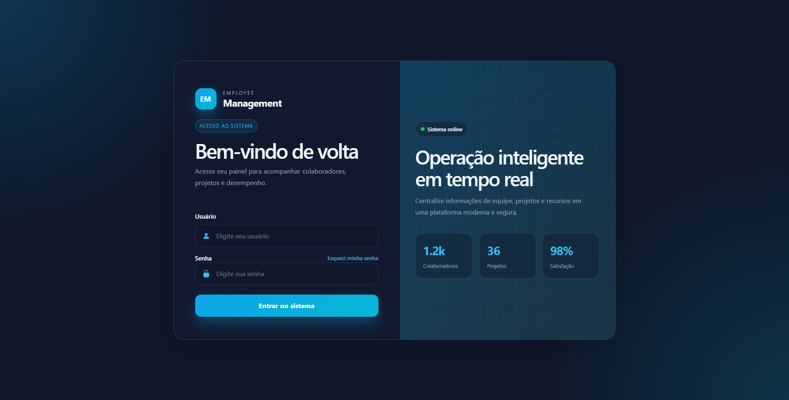

### 📊 Dashboard

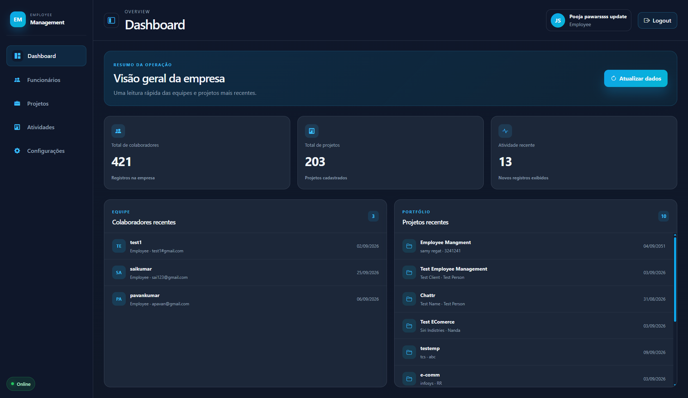

### 👥 Funcionários

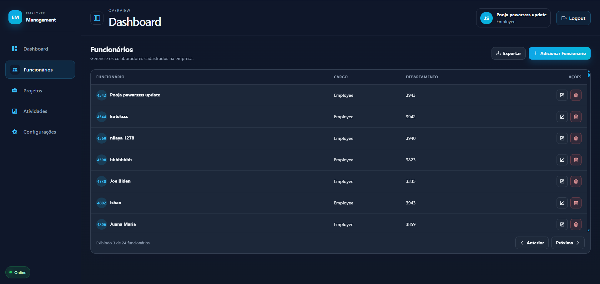

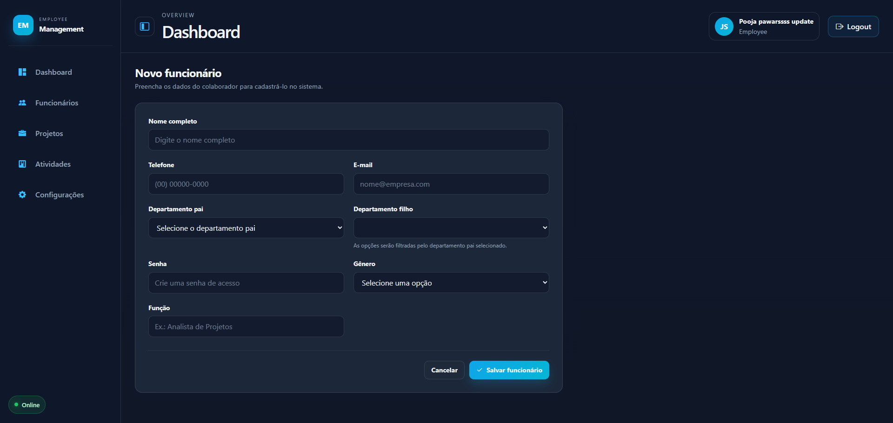

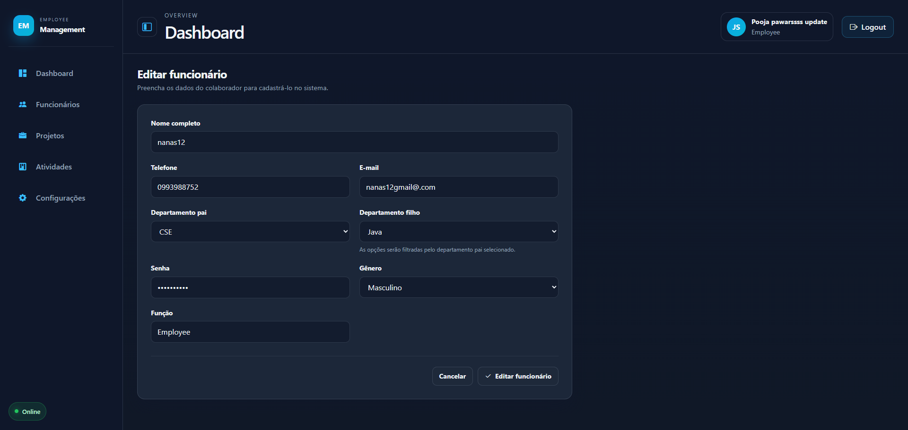

### 📁 Projetos

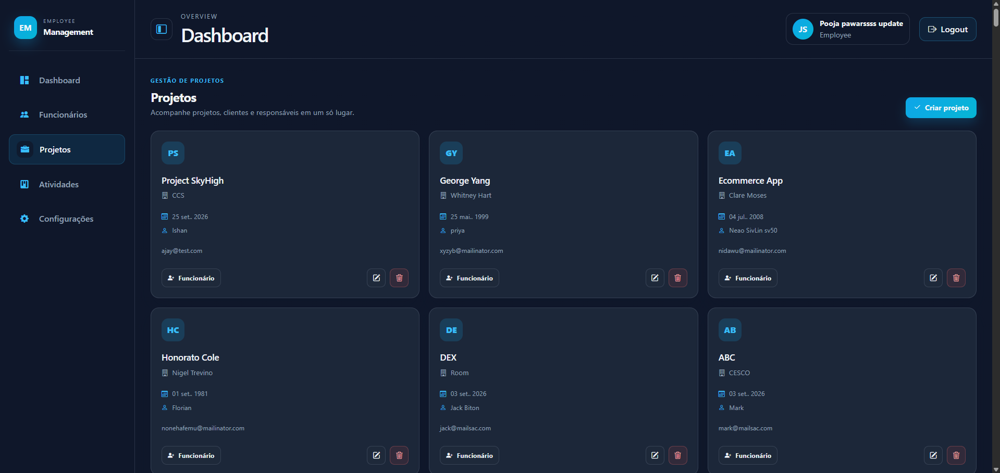

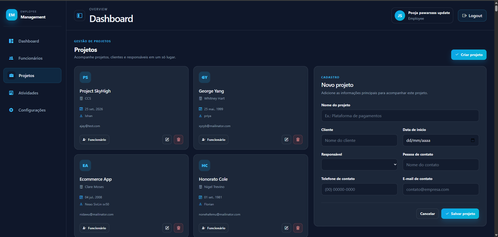

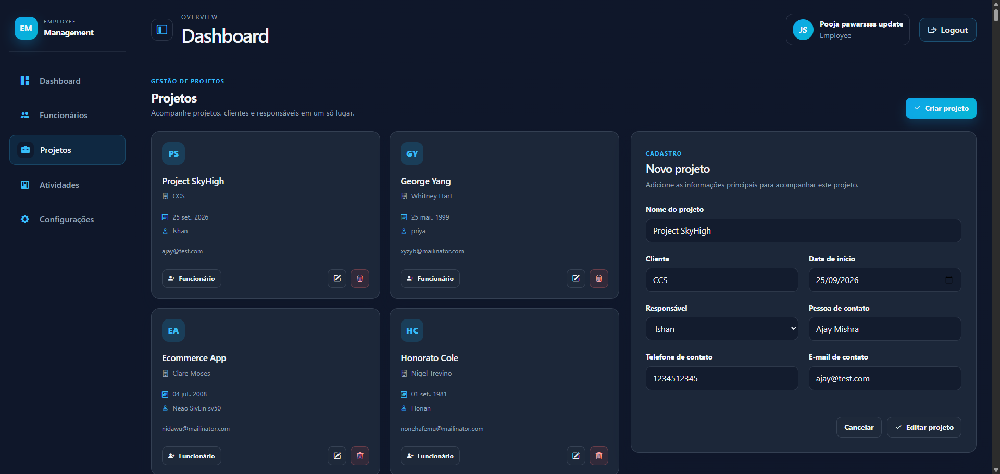

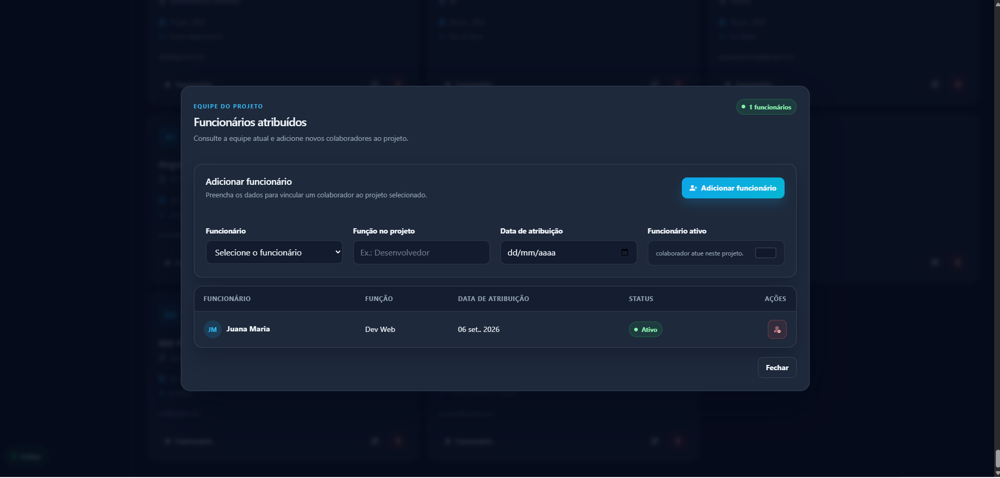

### 🚫 Página não encontrada

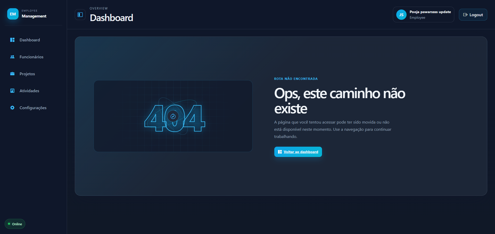

### 👁️‍🗨️ Preview

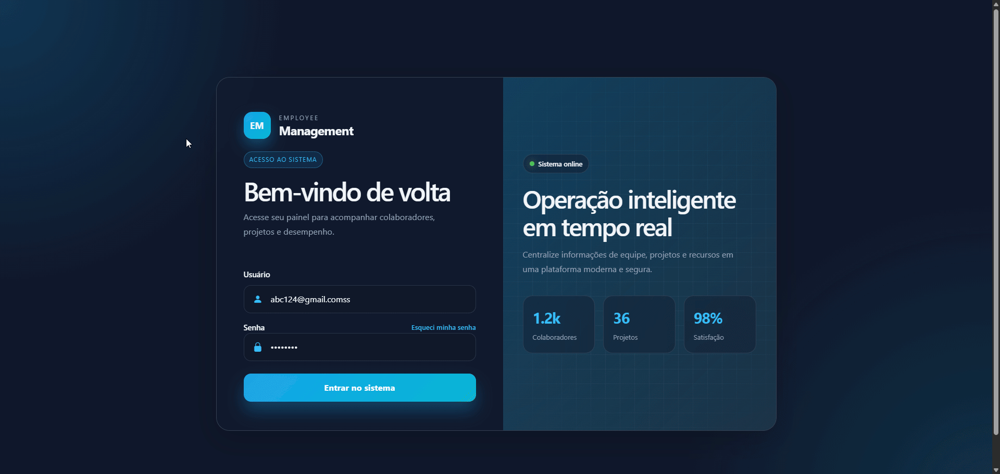

## 📁 Estrutura de diretórios

```text
employee_management_22/
├── public/                         # 📦 Assets públicos
├── src/
│   ├── index.html                  # 🌐 Documento HTML principal
│   ├── main.ts                     # 🚀 Bootstrap da aplicação Angular
│   ├── styles.css                  # 🎨 Tema global e classes CRUD compartilhadas
│   ├── environments/               # ⚙️ Configurações por ambiente
│   └── app/
│       ├── app.config.ts           # 🔧 Configuração global e providers
│       ├── app.routes.ts           # 🧭 Rotas da aplicação
│       ├── core/
│       │   ├── globalConstant/     # 🔑 Constantes dos endpoints
│       │   ├── model/              # 📐 Interfaces e modelos de dados
│       │   └── services/           # 🔌 Serviços HTTP e regras de integração
│       └── pages/
│           ├── dashboard/          # 📊 Dashboard
│           ├── employee-form/      # 📝 Formulário de funcionário
│           ├── employee-list/      # 👥 Listagem de funcionários
│           ├── layout/             # 🧭 Sidebar, navbar e outlet principal
│           ├── login/              # 🔐 Autenticação
│           ├── master/             # 🗂️ Tela de departamentos
│           ├── notfound/           # 🚫 Tela 404
│           ├── project-assignment/ # 👨‍💻 Atribuição em projetos
│           └── projects/           # 📁 CRUD de projetos
├── angular.json                    # 🅰️ Configuração do Angular CLI
├── package.json                    # 📦 Scripts e dependências
├── tsconfig.json                   # 🧩 Configuração base do TypeScript
└── README.md                       # 📚 Documentação do projeto
```

## 🔌 Integração com a API

Os endpoints são centralizados em:

```text
src/app/core/globalConstant/Global.constant.ts
```

Os serviços utilizam `HttpClient` e a URL configurada no ambiente. Entre os recursos integrados estão:

- 📊 Dashboard
- 👥 Funcionários
- 🗂️ Departamentos pai e filho
- 📁 Projetos
- 👨‍💻 Funcionários atribuídos a projetos

## 🎓 O que aprendemos neste projeto

- 🧱 Organização de uma aplicação Angular por páginas, serviços e modelos
- 🧭 Configuração de rotas filhas dentro de um layout administrativo
- 🔌 Integração de componentes com APIs REST usando `HttpClient` e RxJS
- 📐 Criação de interfaces TypeScript para respostas da API
- 📝 Uso de Reactive Forms para cadastros e edição de dados
- 🔄 Atualização de telas com signals e observables
- 🎨 Centralização de variáveis CSS para manter consistência visual
- 📊 Construção de dashboards com indicadores e listas recentes
- 🧩 Criação de componentes responsivos com Bootstrap e CSS próprio
- 🚫 Tratamento visual de rotas inexistentes dentro do sistema
- 🧪 Estruturação de componentes para testes unitários

## 📚 Recursos e links úteis

- 📘 [Documentação do Angular](https://angular.dev/)
- 🧰 [Angular CLI](https://angular.dev/tools/cli)
- 🎨 [Bootstrap](https://getbootstrap.com/)
- 🖼️ [Bootstrap Icons](https://icons.getbootstrap.com/)
- 🔄 [RxJS](https://rxjs.dev/)
- 🧪 [Vitest](https://vitest.dev/)
- 📡 [Angular HttpClient](https://angular.dev/guide/http)
- 🧭 [Angular Router](https://angular.dev/guide/routing)

## 🤝 Contribuição

1. 🍴 Faça um fork do projeto.
2. 🌿 Crie uma branch para sua alteração:

   ```bash
   git checkout -b feature/minha-alteracao
   ```

3. 💾 Faça commits pequenos e objetivos.
4. 📤 Envie a branch para o GitHub.
5. 🔃 Abra um Pull Request descrevendo a alteração.

## 📄 Licença

Este projeto ainda não possui uma licença definida. Adicione um arquivo `LICENSE` antes de publicar termos formais de uso, cópia ou distribuição.

## 👤 Autor

Projeto **Employee Management 22** desenvolvido para estudo e prática de Angular, integração com APIs e construção de interfaces administrativas.
